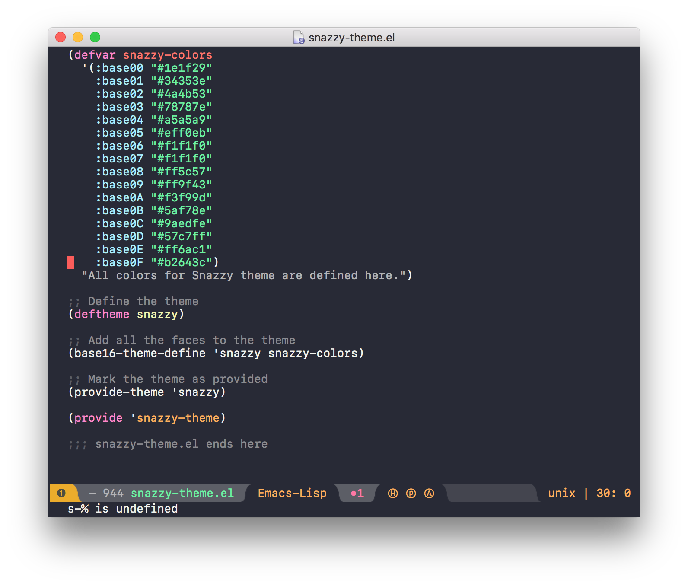

# Emacs-snazzy

> Elegant Emacs theme with bright colors



## Install

### Manually

<!-- Add `snazzy-theme.el` to your `load-path` and add the following line to your `init.el` -->
1. Install `base16-theme` from MELPA/manually.
2. Install `snazzy-theme.el` by running `M-x package-install-file` and point to the file.
3. Add the following line to your `init.el`.

```elisp
(load-theme 'snazzy t)
```
### MELPA
This theme is now on [MELPA](https://melpa.org/#/getting-started)! Run the following command
```
M-x package-install
```
and enter `snazzy-theme`. Voila!

(You might need run `M-x package-refresh-contents` first)


## Related

- [hyper-snazzy](https://github.com/sindresorhus/hyper-snazzy) - Hyper version
- [iterm2-snazzy](https://github.com/sindresorhus/iterm2-snazzy) - iTerm2 version
- [terminal-snazzy](https://github.com/sindresorhus/terminal-snazzy) - Terminal version


## Credits
This color scheme is originally by [Sindre Sorhus](https://sindresorhus.com). I merely adapted his theme for Emacs and decided to share it for those who are looking for this color scheme for Emacs, as well as to learn to create my own Emacs package.


## Contributing
Since I did not create this color scheme, feel free to create a pull request to make it more closely resemble the original vision of the author.


## License

MIT © [Sindre Sorhus](https://sindresorhus.com)  
GPLv3 © [Wei Jian Gan](http://weijiangan.me)
